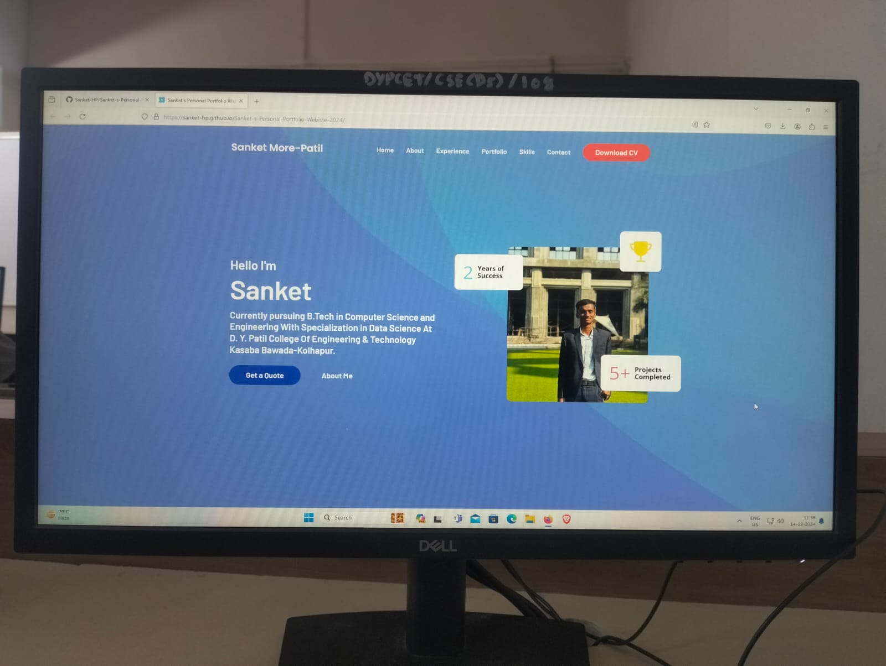

### Demo Screeshots



### Prerequisites

Before you begin, ensure you have met the following requirements:

* [Git](https://git-scm.com/downloads "Download Git") must be installed on your operating system.

### Run Locally

To run **Portfolio** locally, run this command on your git bash:

Linux and macOS:

```bash
sudo git clone (https://sanket-hp.github.io/Sanket-s-Personal-Portfolio-Webiste-2024/)
```

Windows:

```bash
git clone (https://sanket-hp.github.io/Sanket-s-Personal-Portfolio-Webiste-2024/)
```

### Contact

If you want to contact with me you can reach me at [Linkedin](https://www.linkedin.com/in/sanket-more-patil-3149a9255?utm_source=share&utm_campaign=share_via&utm_content=profile&utm_medium=android_app).

### License

This project is **free to use** and does not contains any license.
<footer>@ Sanket Sarjerao More-Patil</footer>
